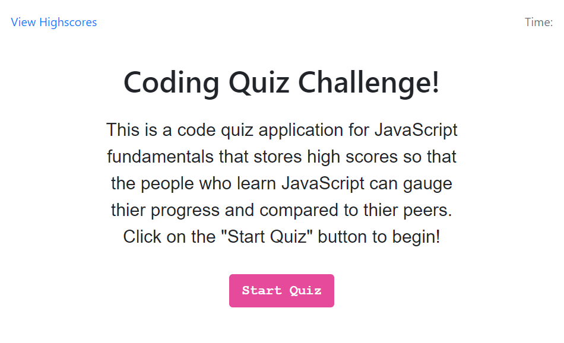
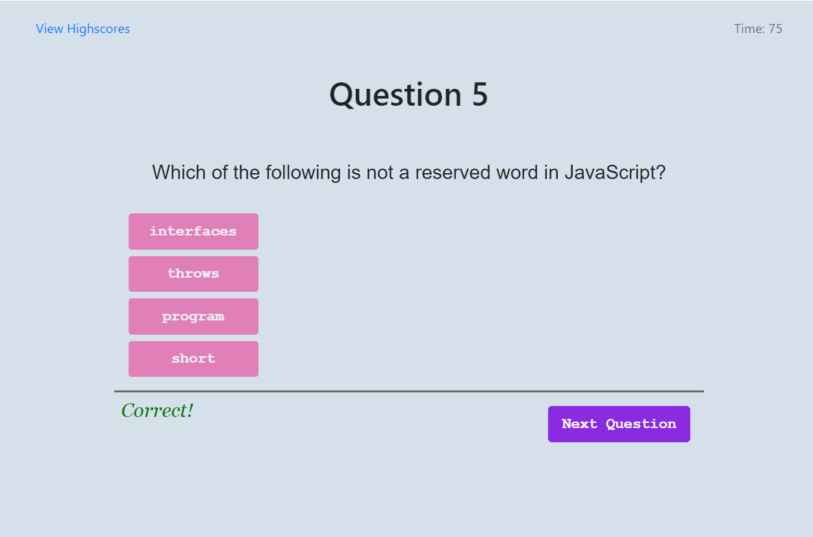
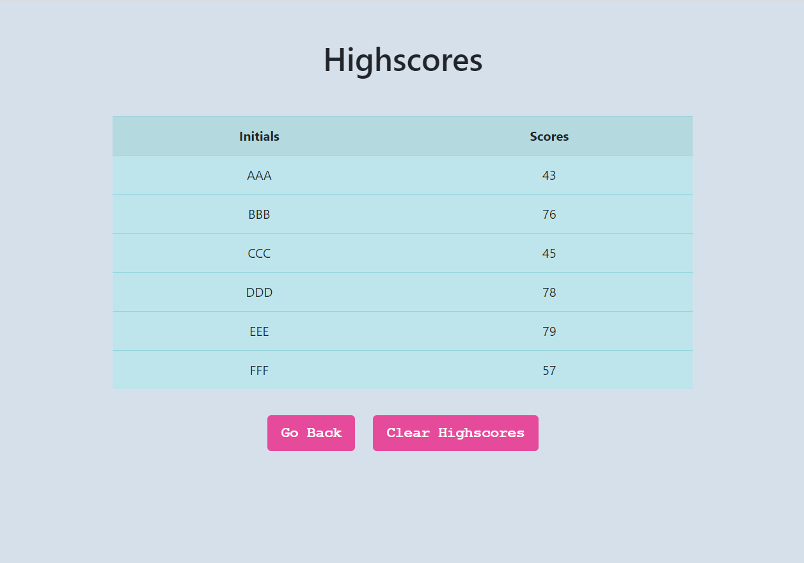

# Code Quiz
## Timer-Based Javascript Code Quiz Application

### Table of Contents
* General Info
* Link
* Files
* Technologies

### General Info
This is a timer-based Javascript code quiz application.
The user can start taking quiz by clicking on the "Start Quiz" button.
Once quiz starts, the timer on the top right corner of the application starts counting down.
The four choices of answer are givin and the user can click on their choice of answer.
The score is calculated based on the number of correct answers and the remaing time.
The user is asked to enter his/her initial at the end and the initial and the score are stored in localStorage.

The user is able to view the highestscore by clicking on the "Highestscore" link on the top left corner of the application.

### Link
[Click here to Take Javascript Code Quiz](https://emi-dev.github.io/Code-Quiz/)

### Files
* index.html
* style.css (under "assets/css")
* script.js (under "assets/js")
* README.md

### Technologies
Project is created with:
* JavaScript
* HTML 5
* CSS 3
* Bootstrap 4