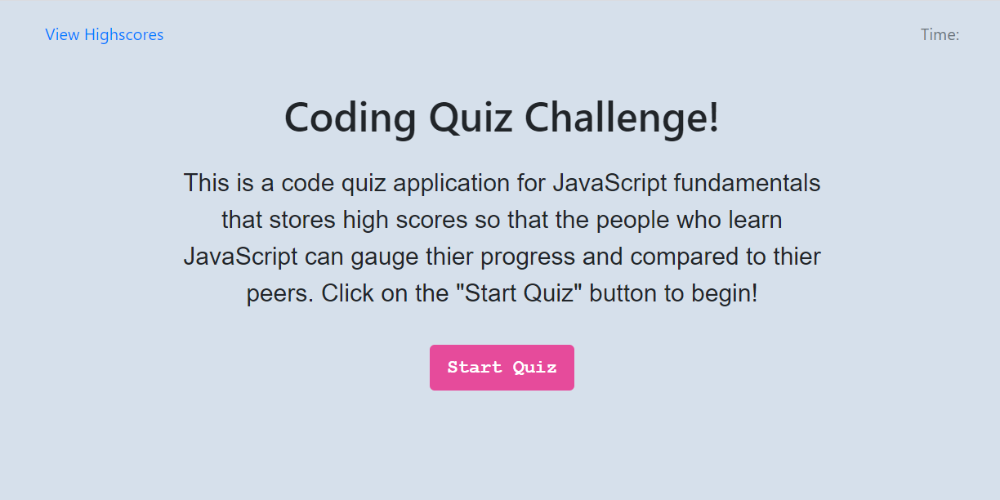

# Code Quiz
## Timer-Based Javascript Code Quiz Application

### Table of Contents
* General Info
* Link
* Files
* Technologies

### General Info
This is a timer-based Javascript code quiz application.
The user can start taking quiz by clicking on the "Start Quiz" button.
Once quiz starts, the timer on the top right corner of the application starts counting down.
The four choices of answer are givin and the user can click on their choice of answer.
When the answer was wrong, 15 seconds are subtracted from the time left.
When the quiz is done, the time remaining will be the user's final score.
If the user runs out of time before completing the quiz, or there are less than 15 sedonds left when the user answered wrong,
the final score will be 0 (zero).
The user is asked to enter his/her initial at the end and the initial and the score are stored in localStorage.
If the user has stored score (has played the quiz before), only the highest score of the user is stored in localStorage.
The Highscores page shows the table of highscores of all users that have played the quiz on the local machine.
The highscore data will be deleted when the "Clear Highscores" button is clicked.

### Link
[Click here to Take Javascript Code Quiz](https://emi-dev.github.io/Code-Quiz/)

### Files
* index.html
* style.css (under "assets/css")
* script.js (under "assets/js")
* README.md

### Technologies
Project is created with:
* JavaScript
* HTML 5
* CSS 3
* Bootstrap 4